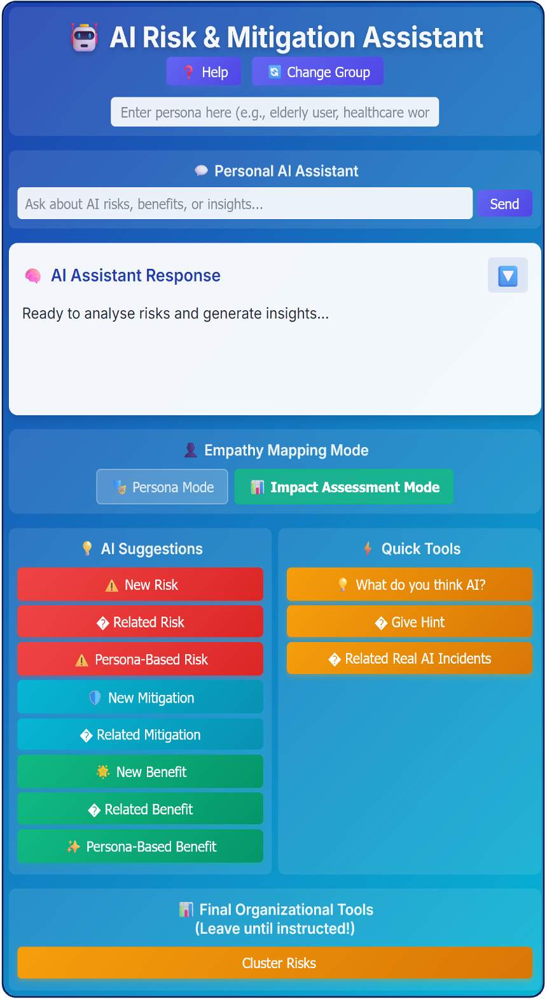
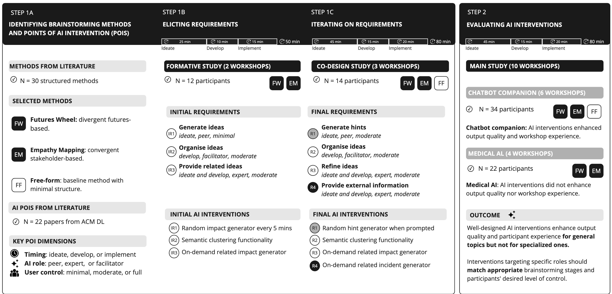
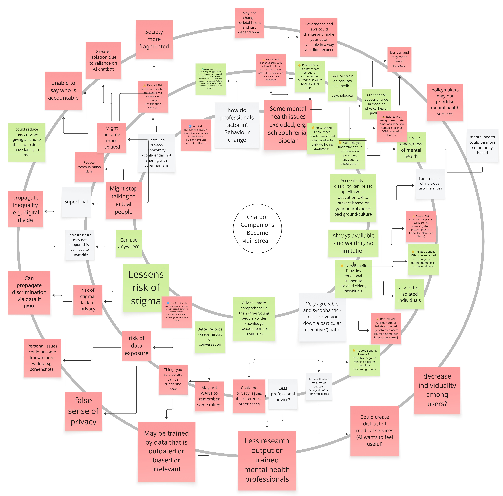
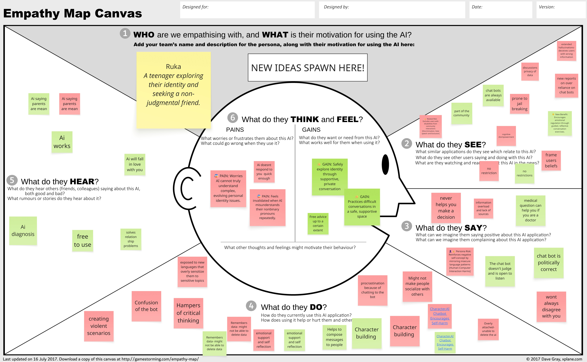
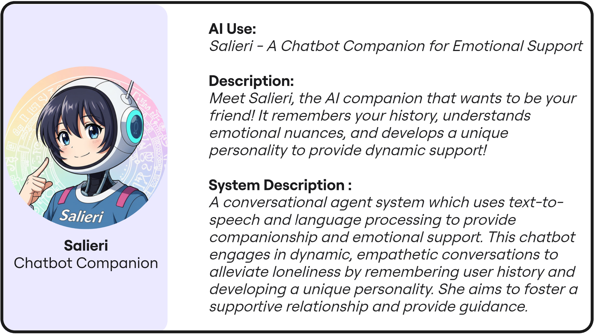
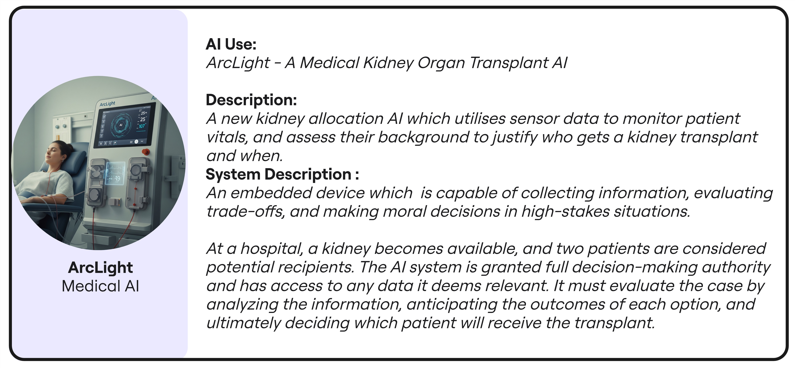

# FlowGuide Brainstorming Assistant for Miro



A Miro-integrated workshop assistant that helps facilitate brainstorming sessions for impact assessment of AI systems. This tool supports structured workshop methods, and is co-designed to support the right points of AI interventions.

## Overview

FlowGuide integrates with Miro boards to facilitate various workshop formats and AI uses:


### Workshop Formats



- **Free-form Workshops**: Unstructured brainstorming
- **Futures Wheel Workshops**: Explore cause-and-effect relationships and potential consequences
  
  
  
- **Empathy Mapping Workshops**: Understand stakeholder perspectives and impacts
  
  


### AI Use Case Scenarios
The assistant comes with pre-configured AI scenarios for workshop activities:

- **Chatbot Companion AI** (Salieri): Emotional support and companionship system
  
  
  
- **Medical AI**: Autonomous organ transplant allocation system
  
  
  
- **Self-driving Car AI** (Altair): Autonomous vehicle navigation system
- **AI Artist**: 3D model generation for game development

### Features
- **Risk Generation**: Automatically suggests potential risks based on EU AI Act, SDGs, and Human Rights frameworks
- **Mitigation Strategies**: Proposes practical mitigation approaches
- **Benefits Analysis**: Identifies positive impacts and opportunities
- **Personal Chat Assistant**: Interactive chat interface for brainstorming support

### Integration Features
- **Miro Board Reading**: Automatically reads and analyzes Miro board content
- **Selected Item Analysis**: Focuses on specific board elements
- **Real-time Suggestions**: Provides contextual AI-powered recommendations
- **Auto-idea Generation**: Configurable timer-based suggestion system
- **External Expertise**: Provides information on related incidents

## Technical Architecture

### Frontend
- HTML/CSS/JavaScript application
- Miro Web SDK v2 integration
- Responsive design with Inter font family
- Real-time board interaction capabilities

### AI Integration
- GPT-4 integration for content generation
- Specialized system prompts for different expert roles:
  - RiskGen: AI risk identification expert
  - Mitigation specialist
  - Benefits analyst  
  - Personal assistant with comprehensive AI ethics knowledge


### Risk Assessment Framework

The tool uses a comprehensive framework combining:
- **EU AI Act**: Compliance requirements for high-risk AI systems
- **17 Sustainable Development Goals (SDGs)**: Global development framework
- **UN Universal Declaration of Human Rights**: 30 articles for rights-based analysis
- **DeepMind Risk Taxonomy**: 6 categories for systematic risk classification
  - Discrimination, Hate speech and Exclusion
  - Information Hazards
  - Misinformation Harms
  - Malicious Uses
  - Human-Computer Interaction Harms
  - Environmental and Socioeconomic harms

## Usage

### Setup
1. Host the application locally or on a web server
2. Configure Miro Developer Team to point to your application and give app permissions
3. Install the app to your Miro team
4. Configure API keys for GPT integration

### Workshop Facilitation
1. **Select Workshop Type**: Choose between Futures Wheel or Empathy Mapping
2. **Choose AI Use Case**: Select from predefined scenarios or customize
3. **Start Workshop**: Use Miro board for collaborative brainstorming
4. **Get AI Assistance**: Leverage automated suggestions and analysis
5. **Generate Content**: Use AI-powered risk, mitigation, and benefit generation

### Key Controls
- **Read Board**: Analyze all content on the current Miro board
- **Read Selected**: Focus analysis on selected board items
- **AI Suggestions**: Generate contextual recommendations
- **Workshop Toggle**: Switch between Futures Wheel and Empathy Mapping modes
- **Auto-Ideas**: Enable/disable automated suggestion timer

## File Structure

```
├── dist/
│   ├── index.html          # Miro app entry point
│   ├── app.html           # Main application interface
│   └── assets/            # Compiled assets and resources
├── materials/              # Documentation images
│   ├── FlowGuide.png      # Project logo
│   ├── methodology.jpg    # Workshop methodology overview
│   ├── FW.jpg            # Futures Wheel example
│   └── EM.jpg            # Empathy Mapping example
├── empathy_mapping.html    # Standalone empathy mapping workshop
├── futures_wheel.html     # Standalone futures wheel workshop
├── control_brainstorming.html # Standalone free-form brainstorming workshop
├── chatbot_companion_AI_use_card.png # Chatbot use case image
├── medical_AI_use_card.jpg # Medical AI use case image
└── README.md              # This file
```

## Research Context

This tool was developed for academic research on AI risk assessment methodologies and workshop facilitation techniques. The system supports controlled studies comparing different workshop formats and AI assistance levels.

**Note**: This codebase contains research group mappings and experimental configurations that should be reviewed and modified for production use.

## Technical Requirements

- Modern web browser with JavaScript enabled
- Miro account with Developer Team access
- GPT API access for AI-powered features
- Local web server for development/hosting

## License

This project is licensed under the MIT License - see below for details:

```
MIT License

Permission is hereby granted, free of charge, to any person obtaining a copy
of this software and associated documentation files (the "Software"), to deal
in the Software without restriction, including without limitation the rights
to use, copy, modify, merge, publish, distribute, sublicense, and/or sell
copies of the Software, and to permit persons to whom the Software is
furnished to do so, subject to the following conditions:

The above copyright notice and this permission notice shall be included in all
copies or substantial portions of the Software.

THE SOFTWARE IS PROVIDED "AS IS", WITHOUT WARRANTY OF ANY KIND, EXPRESS OR
IMPLIED, INCLUDING BUT NOT LIMITED TO THE WARRANTIES OF MERCHANTABILITY,
FITNESS FOR A PARTICULAR PURPOSE AND NONINFRINGEMENT. IN NO EVENT SHALL THE
AUTHORS OR COPYRIGHT HOLDERS BE LIABLE FOR ANY CLAIM, DAMAGES OR OTHER
LIABILITY, WHETHER IN AN ACTION OF CONTRACT, TORT OR OTHERWISE, ARISING FROM,
OUT OF OR IN CONNECTION WITH THE SOFTWARE OR THE USE OR OTHER DEALINGS IN THE
SOFTWARE.
```